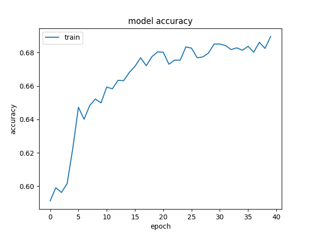

# snake_ai
An effort to make a smart agent that can be taught by the gameplay of a human player and play successfully the classic game Snake.  Implemented using Deep NN.

Model Structure             |  Training Accuracy through epochs
:-------------------------:|:-------------------------:
  |  

### Demo

